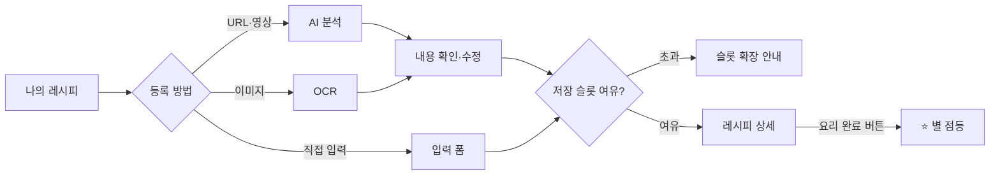
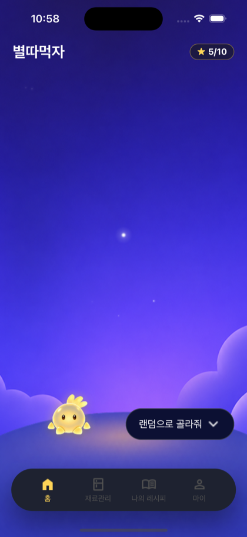
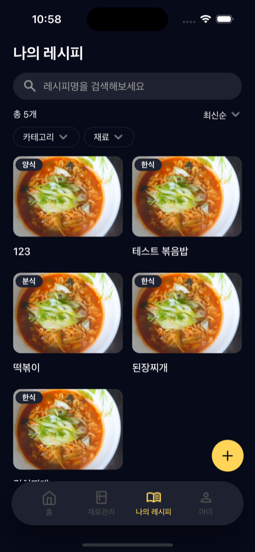
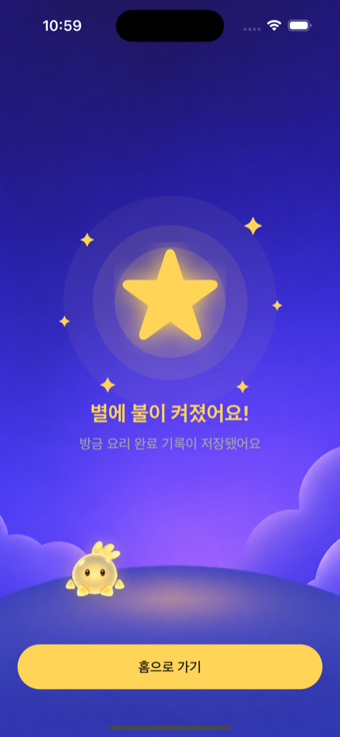
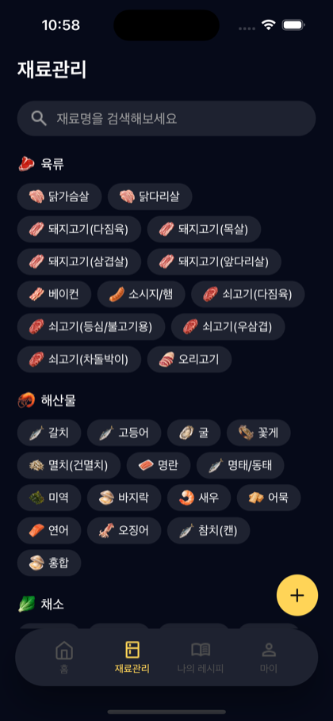
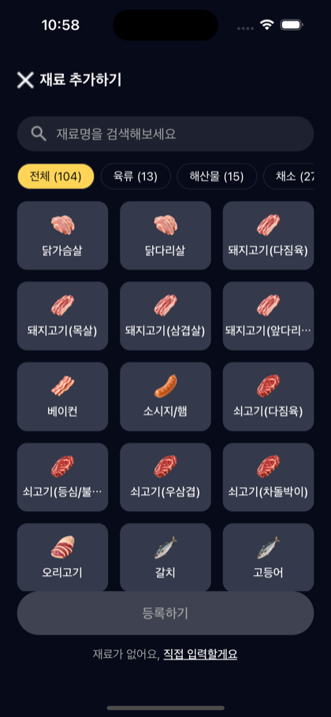
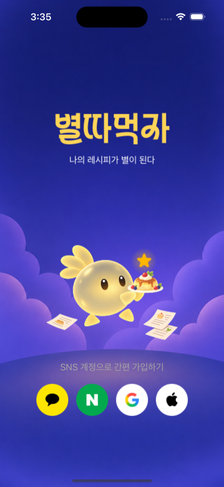
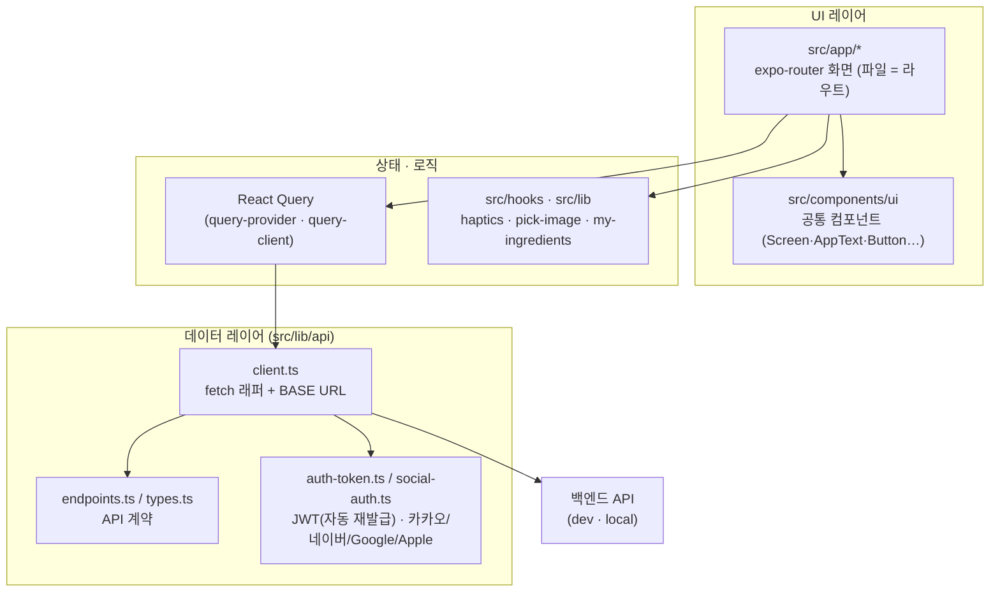

<div align="center">

# ⭐ 별따먹자 (byeolddameokja)

**레시피를 저장하고, 요리를 완료하면 별이 켜지는 게이미피케이션 레시피 앱**

_"저장"이 아니라 "해먹었다"는 완료 기록으로 요리 실행을 동기부여합니다._

<br />

[](https://docs.expo.dev/versions/v57.0.0/)
[](https://reactnative.dev/)
[](https://react.dev/)
[](https://www.typescriptlang.org/)
[](https://www.nativewind.dev/)
[](https://pnpm.io/)
[](#-디자인-시스템-다크-전용)

</div>

---

## 📖 이게 무슨 서비스인가요?

레시피를 **여러 경로(URL·영상 · 이미지 · 직접 입력)로 쉽게 저장**하고, 냉장고 재료를 관리하며, **요리를 완료하면 ⭐별이 켜지는** 게이미피케이션 앱입니다.

- 🎯 **차별점** — 단순 스크랩이 아니라 **"해먹었어요" 완료 기록 → 별 점등(별따먹자)**. 앱 이름이 곧 핵심 루프입니다.
- 🤖 **AI 정리** — 영상 / 이미지 / 링크를 넣으면 **요리명 · 재료 · 조리순서**로 자동 구조화합니다.
- 🧊 **내 냉장고** — 보유 재료와 유통기한 임박(D-1 등)을 관리하고, 533종 재료에서 검색·필터로 담습니다.

> 팀: **SWYP 앱 6기 2팀** · 저장소: [`swyp-app-6-team-2/frontend`](https://github.com/swyp-app-6-team-2/frontend) (이 repo = 프론트엔드)

---

## ✨ 핵심 기능

| 축 | 내용 |
|---|---|
| 🍳 **나의 레시피** | 저장한 레시피 목록 · 검색 · 필터 · 상세 · **요리 완료 기록(별 점등)** |
| 🧊 **재료 관리(내 냉장고)** | 보유 재료 · 유통기한 임박 관리 · 재료 추가(카테고리 필터) |
| ➕ **3경로 등록** | URL/영상 → AI 분석 · 이미지 → OCR · 직접 입력 폼 (모두 하나의 `Recipe`로 수렴) |
| 🏠 **홈 / 마이** | 별 진행도 · 추천 · 임박 요약 / 저장 슬롯 사용량 · 설정 |
| 🔐 **소셜 로그인** | 카카오 · 네이버 · Google · Apple · 신규 가입(약관 동의) · 토큰 자동 재발급 |

### 핵심 사용자 여정



---

## 📱 주요 화면

<table>
  <tr>
    <td align="center"><b>홈 · 별 진행도</b></td>
    <td align="center"><b>나의 레시피</b></td>
    <td align="center"><b>요리 완료 ⭐</b></td>
  </tr>
  <tr>
    <td></td>
    <td></td>
    <td></td>
  </tr>
  <tr>
    <td align="center"><b>재료관리(내 냉장고)</b></td>
    <td align="center"><b>재료 추가하기</b></td>
    <td align="center"><b>로그인 · 시작</b></td>
  </tr>
  <tr>
    <td></td>
    <td></td>
    <td></td>
  </tr>
</table>

> 다크 전용 디자인 · 실제 앱 화면(iOS) 캡처. 화면은 계속 다듬는 중입니다.

---

## 🏗️ 아키텍처

파일 기반 라우팅(`expo-router`) 위에서, 화면은 **공통 컴포넌트**를 조합하고, 서버 상태는 **React Query**를 통해 `src/lib/api` 레이어에서 백엔드와 통신합니다.



**디자인 원칙**
- **다크 전용** · 색은 반드시 토큰(`bg-primary`, `text-muted` …) — 하드코딩 hex 금지
- 디자인 토큰 **3소스 동기화**: `global.css` ↔ `tailwind.config.js` ↔ `src/constants/tokens.ts`
- 화면은 `<Screen>`으로 감싸 배경 / safe-area / margin / 헤더를 일괄 처리
- 있는 공통 컴포넌트부터 재사용 — 2곳 이상 반복될 때만 새로 공통화

---

## 🧰 기술 스택

| 분류 | 사용 기술 |
|---|---|
| **프레임워크** | Expo SDK 57 · React Native 0.86 · React 19 (**React Compiler 켜짐**) |
| **라우팅** | expo-router (파일 기반, `typedRoutes`) |
| **스타일** | NativeWind v4 + Tailwind v3 (다크 전용 토큰) |
| **서버 상태** | @tanstack/react-query |
| **모션 / UX** | react-native-reanimated 4 · expo-haptics |
| **인증** | 카카오/네이버/Google/Apple 네이티브 SDK · JWT 자동 재발급 |
| **이미지** | expo-image · expo-image-picker |
| **툴링** | pnpm · TypeScript 6 · ESLint **v9 고정** · Prettier |
| **빌드 / 배포** | EAS Build & Submit |

> ⚠️ **Expo SDK 57은 API가 많이 바뀌었습니다.** 코드 작성 전 항상 [v57 문서](https://docs.expo.dev/versions/v57.0.0/)를 확인하세요. ESLint는 **v9 고정**(10으로 올리면 `eslint-config-expo` 57이 깨집니다).

---

## 🚀 시작하기

### 1. 사전 준비
- [Node.js](https://nodejs.org/) LTS · [pnpm](https://pnpm.io/installation) · [Expo 개발 빌드](https://docs.expo.dev/develop/development-builds/introduction/)용 시뮬레이터/기기
- 이 프로젝트는 **Expo Go가 아닌 개발 빌드(dev client)** 를 사용합니다 (네이티브 소셜 SDK 포함).

### 2. 설치
```bash
pnpm install
```

### 3. 개발 서버 실행
```bash
pnpm start          # dev client 서버 (기본)
pnpm start:local    # 로컬 백엔드(localhost:8080) 연결 + 캐시 클리어
pnpm start:dev      # dev 백엔드 연결 + 캐시 클리어
```

> 💡 서버 전환은 `EXPO_PUBLIC_API_BASE_URL` 인라인 env로 동작합니다. `.env.local`에 같은 키가 있으면 스크립트 값을 **덮어쓰니** 전환이 안 될 때 확인하세요. 실제 적용값은 콘솔의 `[api] BASE=` 로그로 확인할 수 있습니다.

### 4. 네이티브 실행 (필요 시)
```bash
pnpm ios            # expo run:ios
pnpm android        # expo run:android
```

### 5. 화면 이동 (딥링크)
```bash
xcrun simctl openurl booted "orca:///recipes"   # 예: 나의 레시피 화면으로
```

---

## 🛠️ 개발 명령어

변경 후에는 **반드시** 아래 둘을 통과시키세요.

```bash
pnpm typecheck      # tsc --noEmit
pnpm lint:fix       # expo lint --fix (Prettier 포함)
```

| 명령어 | 설명 |
|---|---|
| `pnpm lint` / `lint:fix` | ESLint 검사 / 자동 수정 |
| `pnpm format` / `format:check` | Prettier 포맷 / 검사 |
| `pnpm web` | 웹으로 미리보기 |

> ⚠️ 타입/린트만으론 런타임 스타일 버그(예: NativeWind `className`↔`style` 충돌)를 못 잡습니다 — 시뮬레이터에서 화면을 띄워 육안 확인하세요.

---

## 📁 프로젝트 구조

```
src/
├─ app/                     # expo-router 라우트 (파일 = 화면)
│  ├─ _layout.tsx           #   루트 Stack (headerShown: false)
│  ├─ (tabs)/               #   하단 탭 그룹 (홈·재료관리·나의레시피·마이)
│  └─ *.tsx                 #   상세·플로우 화면들 (add-recipe, cook-complete …)
├─ components/
│  └─ ui/                   # 공통 컴포넌트 (배럴: index.ts)
├─ constants/tokens.ts      # JS 토큰 (className 밖: placeholder색·safe-area 등)
├─ hooks/                   # 커스텀 훅
└─ lib/
   └─ api/                  # client · endpoints · types · auth-token
app.json                    # 앱 정체성 + EAS 설정
eas.json                    # EAS Build/Submit 프로필
tailwind.config.js          # 색·타이포·간격·radius 토큰
global.css                  # 색상 CSS 변수 (다크 토큰)
```

### 새 화면 추가 (2스텝)
1. `src/app/foo.tsx` → `export default () => <Screen title="…">…</Screen>`
2. `src/app/(tabs)/index.tsx`의 `PAGES`에 한 줄 추가 → 개발용 허브에서 push

---

## 🎨 디자인 시스템 (다크 전용)

**색상 토큰**

| 토큰 | 값 | 용도 |
|---|---|---|
| `background` | `#060A19` | 앱 배경 (navy) |
| `surface` | `#18181B` | 카드·표면 |
| `field` | `#1E2230` | 입력 필드 |
| `primary` | `#FFD457` | 포인트 (gold ⭐) |
| `on-primary` | `#694800` | primary 위 텍스트 |
| `foreground` | `#FFFFFF` | 기본 텍스트 |
| `muted` | `#A4A4A4` | 보조 텍스트 |
| `success` / `error` | `#2FA96B` / `#FF6B5E` | 상태 |

**타이포 (`<AppText variant>`)** — `title`(24 Bold) · `subheading`(22 Bold) · `body`(16 Medium) · `chip`(14 Regular)

**공통 컴포넌트 (`@/components/ui`)** — `AppText` · `Button` · `Chevron` · `Chip` · `ListRow` · `Screen` · `ScreenHeader` · `SearchBar` · `Section` · `SectionTitle` · `Tag`

> 토큰을 바꾸면 `global.css` · `tailwind.config.js` · `src/constants/tokens.ts` **세 곳을 모두** 맞춰야 합니다.

---

## 📱 앱 정체성 (고정값 — 변경 주의)

| 항목 | 값 |
|---|---|
| 표시명 | **별따먹자** |
| iOS 번들 ID / Android 패키지 | `com.byeolddameokja.app` |
| 딥링크 scheme | `orca://` |
| EAS slug | `orca` _(owner 계정은 비공개)_ |

---

## 📚 문서

| 문서 | 내용 |
|---|---|
| [spec.md](./spec.md) | 제품 스펙 — 무엇을 만드는가 (화면·플로우·데이터 모델) |
| [context.md](./context.md) | 프로젝트 오리엔테이션 — 스택·구조·현재 상태 |
| [task.md](./task.md) | 실행 계획 — 무엇부터 하는가 |
| [api-spec.md](./api-spec.md) | 백엔드 API 계약 |
| [CLAUDE.md](./CLAUDE.md) | 에이전트/기여자 작업 규칙 |

> 화면 픽셀 스펙의 최종 출처는 **팀 Figma 확정 디자인**입니다 (파일 링크·키는 팀 내부 공유).

---

<div align="center">

Made with ⭐ by **SWYP 앱 6기 2팀**

</div>
