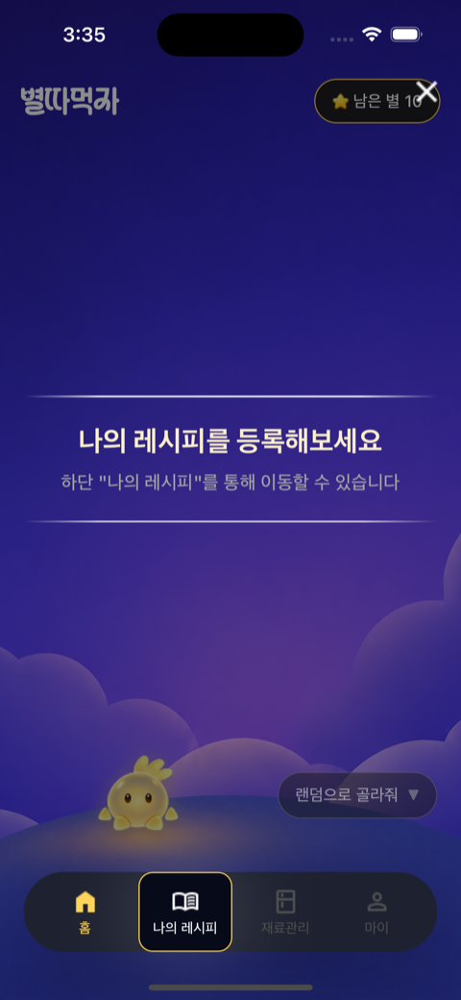
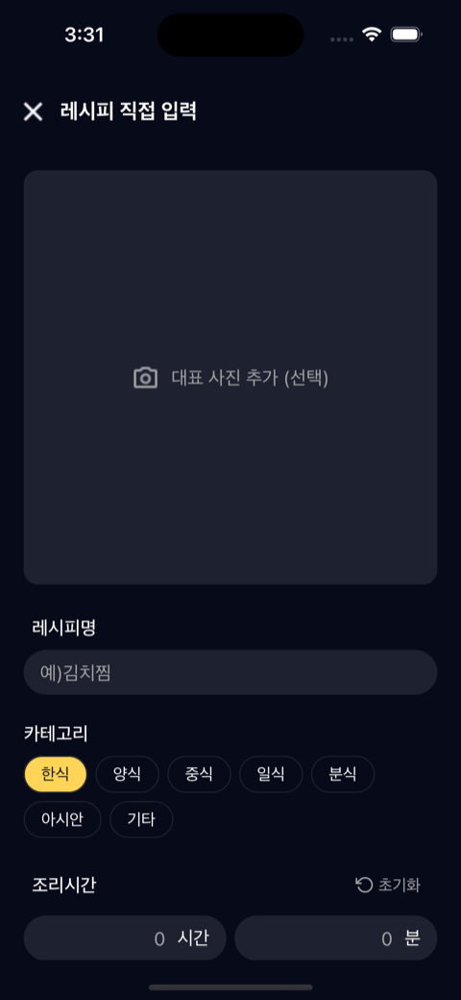
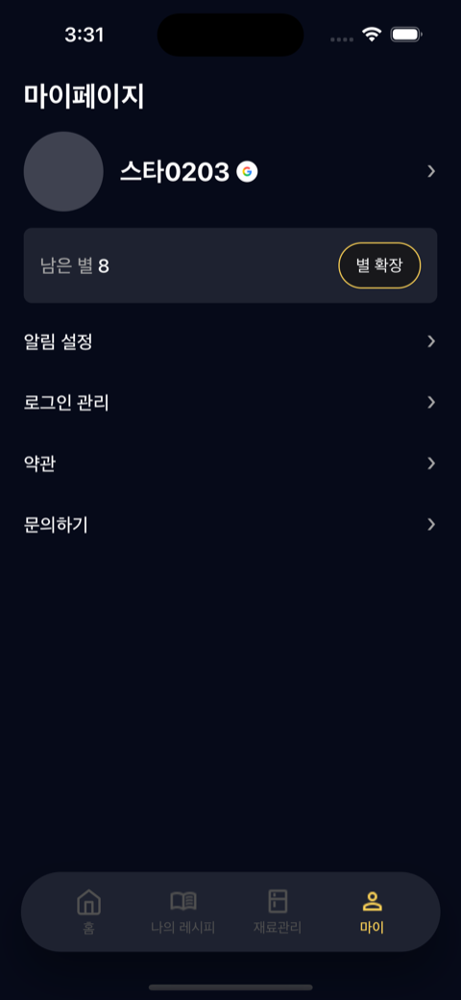
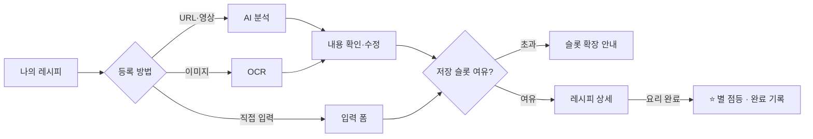
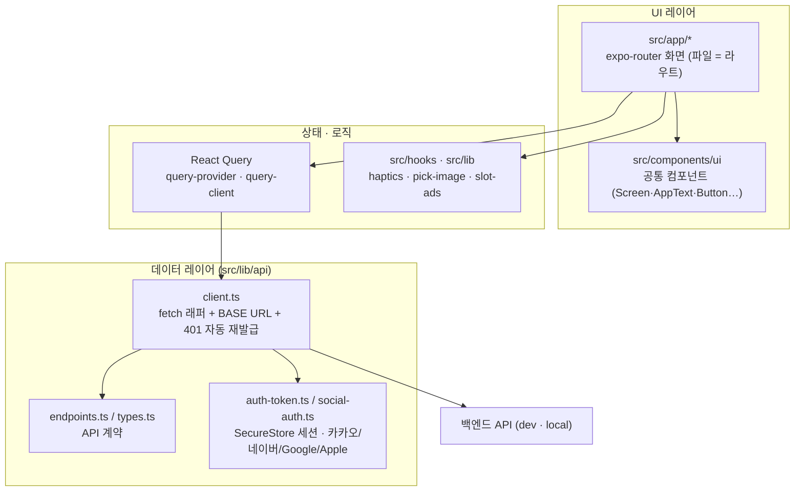

<div align="center">

# ⭐ 별따먹자 · byeolddameokja

### 레시피를 저장하고, **요리를 완료하면 별이 켜지는** 게이미피케이션 레시피 앱

_"저장"에서 끝나지 않게. **"해먹었어요" 완료 기록**으로 요리 실행을 동기부여합니다._

<br />

[](https://docs.expo.dev/versions/v57.0.0/)
[](https://reactnative.dev/)
[](https://react.dev/)
[](https://www.typescriptlang.org/)
[](https://www.nativewind.dev/)
[](https://tanstack.com/query)
[](https://expo.dev/eas)
[](#-디자인-시스템-다크-전용)

_SWYP 앱 6기 2팀 · [`swyp-app-6-team-2/frontend`](https://github.com/swyp-app-6-team-2/frontend) — 이 저장소 = **프론트엔드(Expo React Native)**_

</div>

---

## 📱 화면으로 보는 핵심 루프

> **로그인 → 온보딩 → 홈(별) → 레시피 등록 → 요리 완료(별 점등 ⭐) → 마이** — 이 한 바퀴가 앱 그 자체입니다.

<table>
  <tr>
    <td align="center" width="33%"><b>① 시작 · 소셜 로그인</b></td>
    <td align="center" width="33%"><b>② 온보딩 튜토리얼</b></td>
    <td align="center" width="33%"><b>③ 홈 · 남은 별</b></td>
  </tr>
  <tr>
    <td></td>
    <td></td>
    <td></td>
  </tr>
  <tr>
    <td align="center"><b>④ 레시피 직접 등록</b></td>
    <td align="center"><b>⑤ 요리 완료 · 별 점등 ⭐</b></td>
    <td align="center"><b>⑥ 마이페이지</b></td>
  </tr>
  <tr>
    <td></td>
    <td></td>
    <td></td>
  </tr>
</table>

<div align="center"><sub>다크 전용 디자인 · 실제 iOS 앱 화면 캡처</sub></div>

---

## 📖 이게 무슨 서비스인가요?

레시피를 **여러 경로(URL·영상 · 이미지 · 직접 입력)로 쉽게 저장**하고, 냉장고 재료를 관리하며, **요리를 완료하면 ⭐별이 켜지는** 게이미피케이션 앱입니다.

- 🎯 **차별점** — 단순 스크랩이 아니라 **"해먹었어요" 완료 기록 → 별 점등(별따먹자)**. 앱 이름이 곧 핵심 루프입니다.
- 🤖 **AI 정리** — 영상 / 이미지 / 링크를 넣으면 **요리명 · 재료 · 조리순서**로 자동 구조화합니다.
- 🧊 **내 냉장고** — 보유 재료와 유통기한 임박을 관리하고, 마스터 재료에서 검색·필터로 담습니다.

---

## ✨ 핵심 기능

| 축 | 내용 |
|---|---|
| 🍳 **나의 레시피** | 저장 목록 · 검색 · 필터 · 상세 · **요리 완료 기록 · 완료 축하(별 점등)** |
| ➕ **3경로 등록** | **URL로 등록하기**(AI 분석) · **이미지로 등록하기**(OCR) · **직접 등록하기**(입력 폼) — 모두 하나의 `Recipe`로 수렴 |
| 🧊 **재료 관리(내 냉장고)** | 보유 재료 목록·검색 · 마스터 재료에서 카테고리 필터로 추가 |
| 🏠 **홈** | 남은 별 · 추천(랜덤·재료 기반) · 광고로 별(슬롯) 확장 |
| 👤 **마이** | 프로필(로그인 provider 배지) · **알림 설정** · 로그인 관리 · 약관 · **문의하기(사진 첨부)** |
| 🔐 **소셜 로그인** | 카카오 · 네이버 · Google · Apple · 신규 가입(약관 동의) · 토큰 자동 재발급 |
| 🔔 **알림** | 푸시 알림(FCM) · 알림 시간대 설정 · 딥링크 진입 |

### 등록 → 완료 플로우



---

## 🧭 화면 · 하단 탭

하단 4탭으로 이동하고, 상세·플로우 화면은 그 위로 쌓입니다(`expo-router` Stack).

| 탭 | 라우트 | 역할 |
|---|---|---|
| 🏠 홈 | `/home` | 별 진행도 · 추천 · 슬롯 확장 |
| 📖 나의 레시피 | `/recipes` | 저장 레시피 목록 · 등록(+) · 상세 |
| 🧊 재료관리 | `/ingredients` | 내 냉장고 재료 관리 |
| 👤 마이 | `/my` | 프로필 · 설정 · 문의 |

> 앱 진입점 `(tabs)/index.tsx`는 저장된 세션이 있으면 `/home`, 없으면 `/login`(신규는 온보딩)으로 리다이렉트합니다.

---

## 🏗️ 아키텍처

파일 기반 라우팅(`expo-router`) 위에서 화면은 **공통 컴포넌트**를 조합하고, 서버 상태는 **React Query**를 거쳐 `src/lib/api` 레이어가 백엔드와 통신합니다.



---

## 🧰 기술 스택

| 분류 | 사용 기술 |
|---|---|
| **프레임워크** | Expo SDK 57 · React Native 0.86 · React 19 (**React Compiler 켜짐**) |
| **라우팅** | expo-router (파일 기반, `typedRoutes`) |
| **스타일** | NativeWind v4 + Tailwind v3 — **다크 전용 토큰** |
| **서버 상태** | @tanstack/react-query |
| **모션 / UX** | react-native-reanimated 4 · expo-haptics · react-native-keyboard-controller |
| **인증** | 카카오/네이버/Google/Apple 네이티브 SDK · JWT 자동 재발급 |
| **푸시 알림** | @react-native-firebase/app · messaging (FCM · iOS도 FCM 토큰) |
| **이미지** | expo-image · expo-image-picker |
| **툴링** | pnpm · TypeScript 6 · ESLint **v9 고정** · Prettier |
| **빌드 / 배포** | EAS Build & Submit |

> ⚠️ **Expo SDK 57은 API가 많이 바뀌었습니다.** 코드 전 항상 [v57 문서](https://docs.expo.dev/versions/v57.0.0/) 확인. ESLint는 **v9 고정**(10으로 올리면 `eslint-config-expo` 57이 깨짐).

---

## 🚀 시작하기

**사전 준비** — [Node.js](https://nodejs.org/) LTS · [pnpm](https://pnpm.io/installation) · iOS 시뮬레이터/기기. 이 앱은 **Expo Go가 아닌 개발 빌드(dev client)** 를 씁니다(네이티브 소셜 SDK 포함).

```bash
# 1) 설치
pnpm install

# 2) 개발 서버 (백엔드 연결)
pnpm start:dev      # dev 백엔드(dev-api.starpick.cloud) + 캐시 클리어  ← 보통 이것
pnpm start:local    # 로컬 백엔드(localhost:8080) + 캐시 클리어

# 3) 네이티브 실행 (필요 시)
pnpm ios            # expo run:ios
pnpm android        # expo run:android

# 4) 특정 화면으로 딥링크 이동
xcrun simctl openurl booted "orca:///recipes"
```

> ⚠️ **`pnpm start`(plain)는 `EXPO_PUBLIC_API_BASE_URL`을 설정하지 않습니다.** plain으로 띄우면 API 요청이 Metro로 가 **전부 404**입니다. 백엔드에 붙으려면 `start:dev`(또는 `start:local`)로 실행하세요. 실제 적용값은 콘솔 `[api] BASE=` 로그로 확인.

---

## 🛠️ 개발 명령어

변경 후에는 **반드시** 아래 둘을 통과시킵니다.

```bash
pnpm typecheck      # tsc --noEmit
pnpm lint:fix       # expo lint --fix (Prettier 포함)
```

| 명령어 | 설명 |
|---|---|
| `pnpm lint` / `lint:fix` | ESLint 검사 / 자동 수정 |
| `pnpm format` / `format:check` | Prettier 포맷 / 검사 |
| `pnpm web` | 웹으로 미리보기 |

> ⚠️ 타입/린트만으론 런타임 스타일 버그(예: NativeWind `className`↔`style` 충돌)를 못 잡습니다 — 시뮬레이터에서 화면을 띄워 육안 확인하세요.

---

## 📁 프로젝트 구조

```
src/
├─ app/                     # expo-router 라우트 (파일 = 화면)
│  ├─ _layout.tsx           #   루트 Stack (headerShown: false)
│  ├─ (tabs)/index.tsx      #   앱 진입점 → 세션 유무로 홈/로그인 리다이렉트
│  └─ *.tsx                 #   상세·플로우 화면 (add-recipe-*, cook-complete …)
├─ components/
│  ├─ ui/                   # 공통 컴포넌트 (배럴: index.ts)
│  └─ tab-bar.tsx           # 하단 4탭 (홈·나의 레시피·재료관리·마이)
├─ constants/tokens.ts      # JS 토큰 (className 밖: placeholder색·safe-area 등)
├─ hooks/                   # 커스텀 훅
└─ lib/
   └─ api/                  # client · endpoints · types · auth-token · social-auth
app.json                    # 앱 정체성 + EAS 설정
eas.json                    # EAS Build/Submit 프로필
tailwind.config.js          # 색·타이포·간격·radius 토큰
global.css                  # 색상 CSS 변수 (다크 토큰)
```

**새 화면 추가** — `src/app/foo.tsx`에 `export default () => <Screen title="…">…</Screen>` 만 만들면 `/foo` 라우트로 자동 연결됩니다(별도 등록 불필요).

---

## 🎨 디자인 시스템 (다크 전용)

**색상 토큰**

| 토큰 | 값 | 용도 |
|---|---|---|
| `background` | `#060A19` | 앱 배경 (navy) |
| `surface` | `#18181B` | 카드·표면 |
| `field` | `#1E2230` | 입력 필드 |
| `primary` | `#FFD457` | 포인트 (gold ⭐) |
| `on-primary` | `#694800` | primary 위 텍스트 |
| `foreground` | `#FFFFFF` | 기본 텍스트 |
| `muted` | `#A4A4A4` | 보조 텍스트 |
| `success` / `error` | `#2FA96B` / `#FF6B5E` | 상태 |

**타이포 (`<AppText variant>`)** — `title`(24 Bold) · `subheading`(22 Bold) · `body`(16 Medium) · `chip`(14 Regular)

**공통 컴포넌트 (`@/components/ui`)** — `AppText` · `Button` · `Chevron` · `Chip` · `AlertDialog` · `ListRow` · `PressableScale` · `Screen` · `ScreenHeader` · `SearchBar` · `Section` · `SectionTitle` · `SheetShell` · `Tag`

> 원칙: 화면은 `<Screen>`으로 감싸고 · 색은 반드시 토큰(하드코딩 hex 금지) · 있는 공통 컴포넌트부터 재사용. 토큰을 바꾸면 **`global.css` · `tailwind.config.js` · `src/constants/tokens.ts` 세 곳을 모두** 맞춥니다.

---

## 📦 빌드 & 배포 (EAS)

| 프로필 | 배포 | 확인 위치 | 용도 |
|---|---|---|---|
| `production` | store | App Store Connect / TestFlight | 실제 출시 · 심사 |
| `preview` | internal (ad-hoc) | EAS 대시보드 (설치 QR·링크) | 내부 기기 테스트 |
| `development` | dev client | EAS 대시보드 | 개발(Metro 연결) |

```bash
eas build -p ios --profile production     # 스토어용 .ipa (→ Transporter / eas submit)
eas build -p ios --profile preview        # 내부 배포용 .ipa (설치 QR)
eas build:list --platform ios             # 빌드 목록 · Distribution 확인
```

> iOS는 Android식 "외부배포"가 없습니다 — 외부 테스터는 **TestFlight**가 유일한 길입니다.

---

## 📱 앱 정체성 (고정값 — 변경 주의)

| 항목 | 값 |
|---|---|
| 표시명 | **별따먹자** |
| iOS 번들 ID / Android 패키지 | `com.byeolddameokja.app` |
| 딥링크 scheme | `orca://` |
| EAS slug / owner | `orca` / `leeseunghwan123` |

---

## 📚 문서

| 문서 | 내용 |
|---|---|
| [spec.md](./spec.md) | 제품 스펙 — 화면·플로우·데이터 모델 |
| [context.md](./context.md) | 프로젝트 오리엔테이션 — 스택·구조·현재 상태 |
| [task.md](./task.md) | 실행 계획 |
| [api-spec.md](./api-spec.md) | 백엔드 API 계약 |
| [CLAUDE.md](./CLAUDE.md) | 에이전트/기여자 작업 규칙 |

> 화면 픽셀 스펙의 최종 출처는 **팀 Figma 확정 디자인**입니다(파일 링크·키는 팀 내부 공유).

---

<div align="center">

Made with ⭐ by **SWYP 앱 6기 2팀**

</div>
